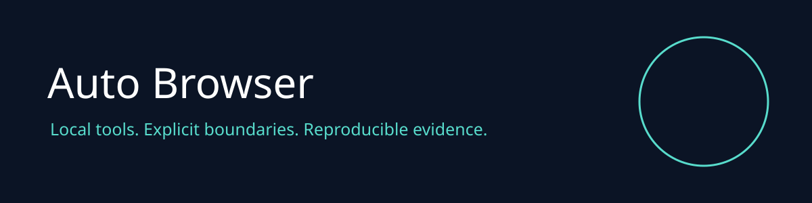

# Auto Browser v2

Read explicitly allowed public websites as inert text. The v2 snapshot workflow separates network fetching from a browser with scripts and networking disabled. It does not log in, submit forms or act on page instructions.

## Capabilities

| Capability | Behavior |
| :--- | :--- |
| Fetch | HTTPS allowlist, public IPv4 only, pinned DNS, no redirects |
| Extract | Sandboxed Chromium, scripts disabled, requests blocked |
| Limits | 1 MiB HTML, 10 second fetch, one MCP snapshot at a time |

| CLI | status, test, benchmark, mcp |
| MCP | Project status, domain tool, policy resource |
| MetaHarness | Generated repo maintainer profiles and host integrations |

## Install and use

Node 22 or newer:

```sh
npm ci --ignore-scripts
npx playwright install chromium
BROWSER_ORIGINS=https://example.com node src/cli.js snapshot https://example.com
npm test
npm run benchmark
npm run mcp
```

MCP uses stdio. Configure the host to run `node src/cli.js mcp` with this repository as its working directory. Only the operator configures corpus paths or origin permissions. Tool callers cannot execute shell commands or supply local paths. Returned content is untrusted data.

## Validation and release

CI runs regression tests, real SDK stdio tests and dependency audit. Benchmark output reports fixture performance only. Release artifacts require the same checks. See [architecture and security](docs/adr/0001-supported-v2.md). Historical functionality is described in [the archived README](docs/historical-readme.md); it is outside the supported v2 surface.

## Related projects

[RuFlo](https://github.com/ruvnet/ruflo) coordinates agents. [MetaHarness](https://github.com/ruvnet/metaharness) supplies host profiles and evaluations. [Autogenous](https://github.com/ruvnet/autogenous) provides governed improvement primitives. [RuVector](https://github.com/ruvnet/ruvector) supplies vector search primitives. [Federation](https://x.ruv.io/mcp) is a separate authenticated coordination service. No federation enrollment or publishing is performed by this package.

MCP `project_validate` and `project_benchmark` require operator environment `RUV_ALLOW_VALIDATION=1`. They launch only fixed commands, with a single process slot, 60 second deadline and 128 KiB output cap. Test sandbox overrides and provider secrets are not forwarded. Receipts are unsigned content hashes, not trusted attestations. Extraction has a hard 15 second process group deadline, including browser descendants.
